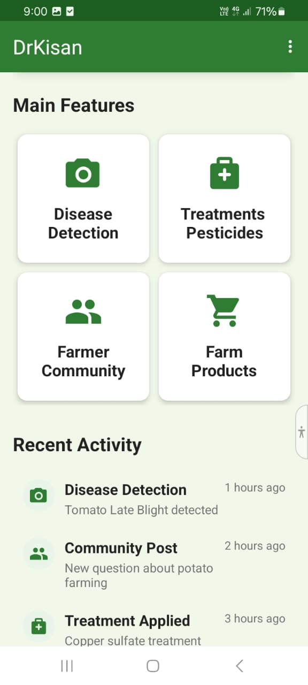
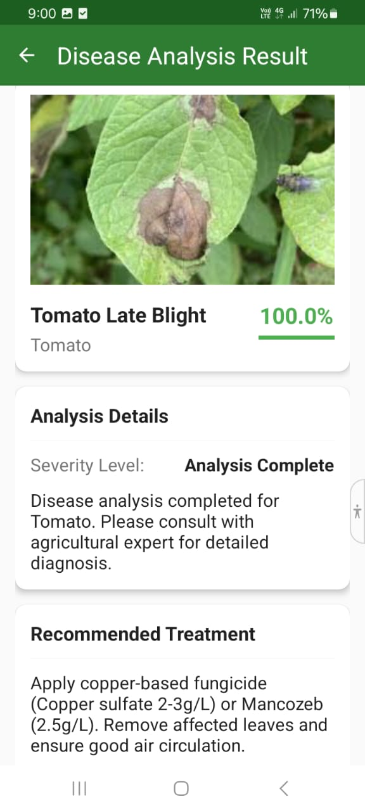
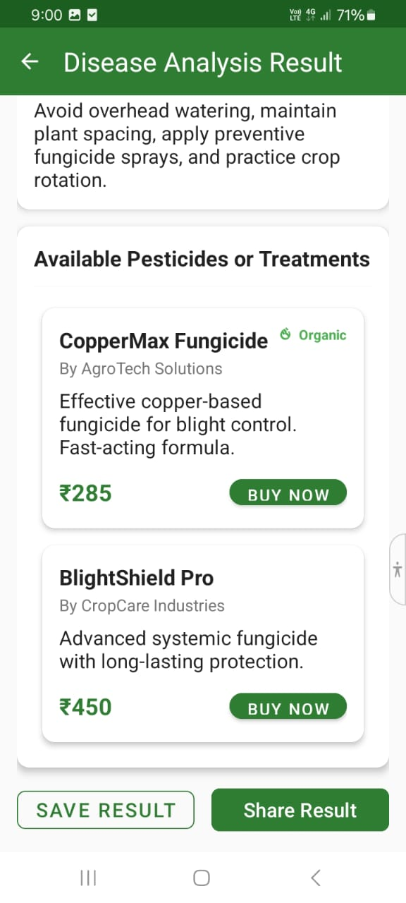
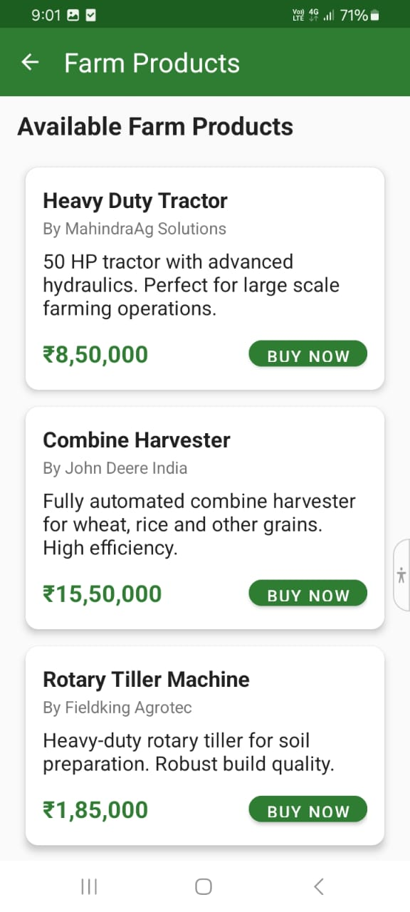
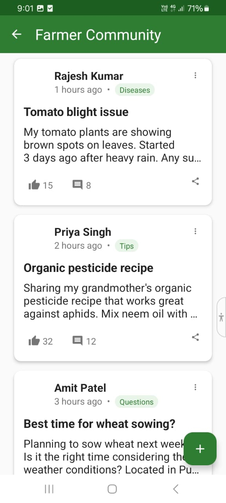

# 🌾 DrKisan - AI-Powered Crop Disease Detection App

  
  
  
  
  

---

## 📱 Overview

**DrKisan** is an innovative Android application that leverages artificial intelligence to help farmers detect crop diseases through image recognition. Using advanced machine learning models and TensorFlow Lite, the app provides instant diagnosis and treatment recommendations, making modern agricultural technology accessible to farmers worldwide.

## ✨ Key Features

🔬 **AI Disease Detection**
- Real-time crop disease identification using device camera
- TensorFlow Lite model with 15+ disease classifications
- Confidence score and severity analysis
- Offline inference capability

🌱 **Smart Agriculture Tools**
- Detailed disease information and symptoms
- Professional treatment recommendations
- Organic and chemical pesticide options
- Prevention strategies and best practices

🛒 **Integrated Marketplace (Demo)**
- Browse farming equipment and machinery
- Pesticides and fertilizers catalog
- Price comparison and product details
- Demo purchase workflow

👥 **Farmer Community (Soon)**
- Discussion forum for agricultural queries
- Experience sharing platform
- Expert advice and tips
- Category-based conversations

📊 **Professional UI/UX**
- Material Design 3 implementation
- Dark/Light theme support
- Intuitive navigation
- Accessibility compliance

## 🛠 Technical Stack

### **Frontend**
- **Android SDK** - Native Android development
- **Java** - Primary programming language
- **XML** - UI layouts and design
- **Material Design 3** - Modern UI components

### **Machine Learning**
- **TensorFlow Lite** - On-device ML inference
- **Custom CNN Model** - Disease classification
- **Image Processing** - Real-time image analysis
- **CameraX** - Advanced camera functionality

### **Architecture & Libraries**
- **MVVM Pattern** - Clean architecture
- **RecyclerView** - Dynamic list management
- **CardView** - Modern UI components
- **Retrofit** - HTTP client (planned)
- **Room Database** - Local data storage (planned)

## 🚀 Skills Demonstrated

### **Mobile Development**
✅ Android native app development  
✅ Complex UI/UX implementation  
✅ Camera integration and image processing  
✅ State management and navigation  

### **Machine Learning Integration**
✅ TensorFlow Lite model implementation  
✅ Real-time image classification  
✅ Model optimization for mobile devices  
✅ Confidence scoring and result interpretation  

### **Software Engineering**
✅ Clean code architecture  
✅ Version control with Git  
✅ Problem-solving and debugging  
✅ User experience design  
✅ Performance optimization  

## 📸 Screenshots

  
  
  
  
  
  
  

## 🧪 Testing

The app has been tested on:
- Android versions 5.0 to 14.0
- Multiple device sizes and resolutions
- Both emulator and physical devices
- Various camera conditions and image qualities

## 🤝 Contributing

Contributions are welcome! Please feel free to submit issues or pull requests.

---

**⭐ If you found this project helpful, please consider giving it a star!**

Made with ❤️ by [Nikhil Tomar]

